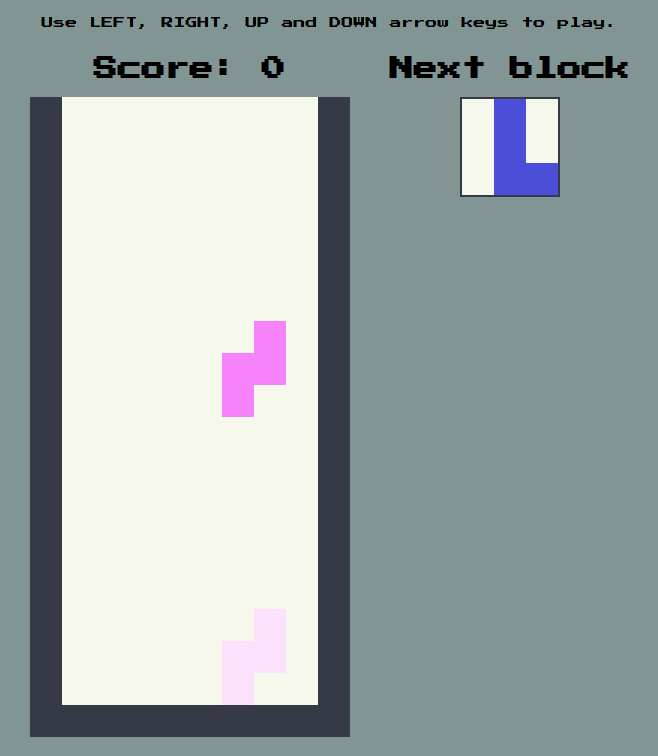

# Tetris
Simple implementation of the Tetris game in pure Javascript

# To Do
* Persit Best Score in localStorage
* SFX when doing a new line
* Welcome screen to choose difficulty
    * Hard - Speed of the block grows faster, no projection
    * Medium - No projection, no speed.
    * Easy - Constant speed and projection of the block to the bottom floor